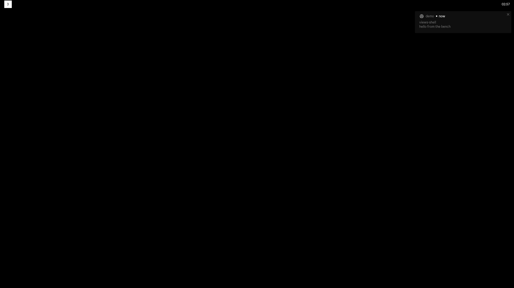
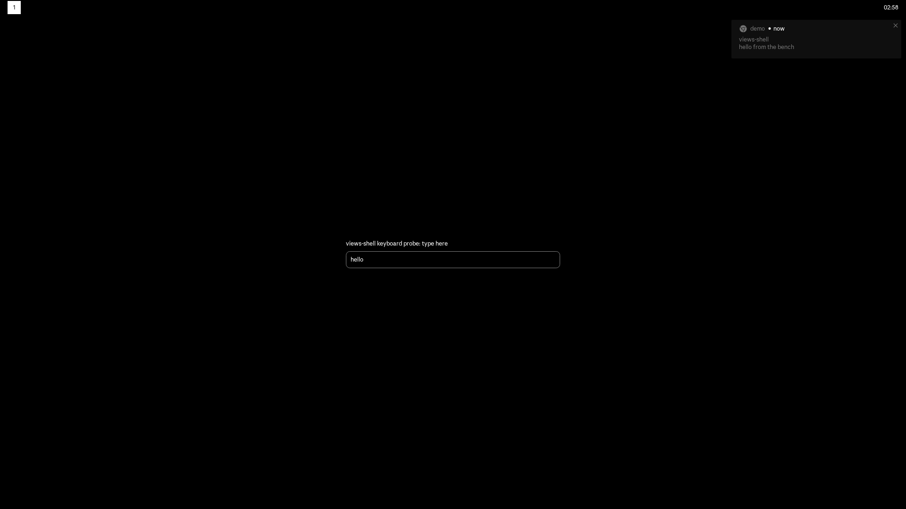

# views_shell assembled: workspaces, notifications and typed input on headless scroll (Chromium 154.0.8037.92)

Measured on the bench on 2026-10-02 by chapter-2 item w3c (claims C21.1 to
C21.5). Every run is `tools/bench/worker/headless.sh` under `runtime-test`
(headless stock scroll 1.13-dev, one 1920x1080 output, a private session bus
from `dbus-run-session`), with `--ozone-platform=wayland --use-gl=angle
--use-angle=swiftshader` (finding F2) and `--theme examples/themes/all-black`,
in software compositing (the default since w1a). The demo runs use
`tools/bench/worker/session-demo.sh` as the client: it starts `views_shell`,
waits for its first attach, sends `notify-send -a demo -t 8000 'views-shell'
'hello from the bench'` once the shell owns `org.freedesktop.Notifications`, and
with `--demo-keyboard` types `hello` with `wtype`. The whole sequence is
`tools/bench/seq/w3c.sh`, run as unit `vs-w3c-seq` under `~/views-bench/bench.lock`:
wire, `ensure-out.sh views`, `gn check '//views_shell/*'`, build, unit tests,
the runs, and the PR's prove commands in the same lock hold.

## What runs

`shell/app/shell_content.{h,cc}` owns everything above the bootstrap, started in
a fixed order and stopped in reverse: theme, then the scroll adapter and its
`WmModel` (on the socket `$SCROLLSOCK`, `$SWAYSOCK` or `$I3SOCK` names; without
one the program logs `wm: no compositor socket ...` once and runs on), then the
notification daemon (when `$DBUS_SESSION_BUS_ADDRESS` is set), then the surfaces.
`views_shell_main.cc` keeps the flags only.

- The bar: `BarView` with `bar::WorkspaceStrip` (`shell/bar/workspace_strip.h`,
  one stock `views::LabelButton` per workspace: focused on a `kColorSysPrimary`
  pill in `kColorSysOnPrimary`, urgent on `kColorSysError`, others in
  `kColorSysOnSurfaceSecondary`) in its left section, the focused window's title
  centred, the clock on the right. The strip redraws from
  `WmModel::Observer::OnSnapshotApplied` only; a click calls
  `WmModel::FocusWorkspace` and changes nothing until the echo (rule R6).
- Notifications: `notifications::NotificationService` (w2c). Each popup is its
  own layer surface on the `notification` SurfaceSpec.
- The keyboard probe (`--demo-keyboard`): a new SurfaceSpec row `modal`
  (overlay layer, no anchor so the compositor centres it, 480x120, no zone,
  exclusive keyboard, namespace `views-shell-modal`) holding
  `KeyboardProbeView` (`shell/app/keyboard_probe_view.h`), a label over a stock
  `views::Textfield` that logs `TYPED <text>` on every change.

## The workspace switch (C21.1)



`--demo-workspace-switch`: one second after the bar's first paint the program
calls `WmModel::FocusWorkspaceByName("3")` (the workspace does not exist yet, so
there is no id to pass to `FocusWorkspace`). The client log, in order:

```
wm: scroll adapter on /run/user/1000/scroll-ipc.1000.9.sock
notifications: serving org.freedesktop.Notifications
wm: focused workspace 1
demo-workspace-switch: FocusWorkspace 3
wm: focused workspace 3
ECHO workspace 3
demo-workspace-switch: command landed
notifications: 1 closed (expired)
```

`ECHO workspace 3` comes from the model's `OnSnapshotApplied`, before the
command's SEND_TICK barrier reports it landed. `tree.json` has `"name": "3"` and
no `"app_id": "views-shell"`: the compositor's window list holds no views-shell
window (rule R1's run gate). The strip shows only `3`: scroll destroys an empty
workspace when it loses focus, so workspace 1 is gone from the snapshot, and the
strip followed the model. Summary: client alive, 15 attaches, 13 sampled
colours, 2 `get_layer_surface` (bar and notification).

## The notification popup (C21.2)


The notify run (no demo flag). The protocol log has two layer surfaces:

```
-> zwlr_layer_shell_v1#11.get_layer_surface(new id zwlr_layer_surface_v1#39, wl_surface#3, nil, 2, "views-shell-bar")
-> zwlr_layer_shell_v1#11.get_layer_surface(new id zwlr_layer_surface_v1#48, wl_surface#42, nil, 3, "views-shell-notification")
```

Layer 3 is overlay. The popup asks for anchor 9 (top and right),
`set_margin(10, 10, 0, 0)`, `set_size(360, 82)` and keyboard interactivity 0.
On its 8 s timeout the server closes it (`notifications: 1 closed (expired)`)
and the client sends `zwlr_layer_surface_v1#48.destroy()`.

## Typed input on a layer surface (C21.3)



`--demo-keyboard`: the modal is requested with `set_anchor(0)`,
`set_size(480, 120)` and `set_keyboard_interactivity(1)` (exclusive). The
headless compositor has no keyboard until `wtype` creates its virtual keyboard.
The seat then gains one, the client binds `wl_keyboard`, and scroll sends
`enter` for the modal at once:

```
keyboard-probe: opening the modal surface
keyboard-probe: textfield focused 0
wl_keyboard#54.keymap(1, fd 361, 1542)
wl_keyboard#54.enter(30, wl_surface#40, array[0])
keyboard-probe: widget active 1
keyboard-probe: textfield focused 1
keyboard-probe: key Escape
TYPED h
keyboard-probe: key Digit1
TYPED he
...
TYPED hello
wl_keyboard#54.leave(42, wl_surface#40)
keyboard-probe: widget active 0
```

The whole path works with no patch change: `wl_keyboard.enter` reaches
`WaylandLayerShellWindow::OnKeyboardFocusChanged` (the layer-shell patch), which
delivers `OnActivationChanged(true)` to the widget. The `FocusManager` then
focuses the `Textfield`, and the keys arrive through Ozone, aura and the input
method as characters. The DOM codes (`Escape`, `Digit1` ...) are the
positions of wtype's generated keymap, not of a real layout: wtype maps each
character it types onto a keycode of its own keymap, and xkb resolves them back
to `h`, `e`, `l`, `l`, `o`. When wtype exits, its keyboard goes away, `leave`
arrives and the widget deactivates.

## Orderly shutdown

`--run-for-seconds=12` under session-demo: the program ended on its own inside
the measure window and session-demo printed `views_shell exited rc 0`. This
covers `ShellContent::Stop()` (surfaces, the D-Bus thread, the adapter's IO
thread) and the bootstrap's teardown in reverse (the w1a follow-up).

## Footprint of the assembled program (C21.5)

The plain `--bar --theme all-black` program, without session-demo, the 10 s
`measure.sh` window after a 4 s settle. The scroll adapter, the WmModel, the
notification daemon (name owned, no popup) and the bar are all running.
Threads, FDs and PSS are summed over the client tree: the FHS `bwrap` (4 FDs)
plus `views_shell`.

| Run | Build | Compositor / client GL | PSS MB | RSS MB | CPU % | Threads | FDs |
|---|---|---|---|---|---|---|---|
| chapter 1 `views_shell --bar` (test factories, `docs/bench/views-shell-154.md`) | component | pixman / SwiftShader | 141 | | 0 | 30 | 344 |
| `w1a-bar` (production factory, `views-shell-154-production.md`) | component | pixman / software compositing | 107.1 | 117.4 | 0 | 15 | 352 |
| `w1b-release-bar` (`views-shell-154-release.md`, before D1) | release | pixman / SwiftShader | 81.1 | | 0 | | 55 |
| **`w3c-plain`: assembled `--bar`** | component | pixman / software compositing | **108.7** | 119.1 | **0.00** | **17** | **362** |
| **`w3c-plain-gpu`: assembled, GPU-fair (w1c)** | component | gles2 on renderD128 / default GL | 128.4 | 154.0 | 0.00 | 16 | 360 |
| **`w3c-release`: assembled `--bar`** | release | pixman / software compositing | **59.7** | 68.3 | **0.00** | **17** | **69** |

Reading:

- Assembling costs little over the w1a bar. The component build gains 1.6 MB of
  PSS and two threads: `scroll_ipc_io`, the adapter's IO thread, and
  `views-shell D-Bus`, the notification daemon's connection. It gains 10 FDs:
  the two i3-ipc sockets, the bus socket and their thread wake-ups. Idle CPU
  stays 0 % and 0 context switches per second, so the adapter and the bus add
  no wake-ups while nothing happens.
- The release build of the whole assembled program is 59.7 MB PSS with 69 FDs.
  w1b's release `--bar` was 81.1 MB, but that build still carried the test
  context factory (D1). The FD count confirms w1c's census. In the component
  build, 332 of the tree's 362 FDs are regular files, which are the module files
  `EnableInProcessStackDumping` pre-opens. In release that is 39 of 69.
- The GPU-fair row (render node bound, gles2 compositor) costs 19.7 MB more
  PSS for the same frame. `views_shell` still composites in software (the
  default), so the difference is the client GL stack the process loads
  anyway. That is w1c's finding again for the assembled program.
- During the demo runs (session-demo's bash and tee in the tree, a popup
  shown) PSS was 112.3 to 113.6 MB, with 19 threads and 373 to 375 FDs.

N=1 per row. First attach was 2.0 to 2.4 s on warm runs; the first run after
the rebuild took 5.3 s (cold page cache, as w1c found).

## Not done here

- Popups that restack leave a gap (w2c's finding: `Widget::SetBounds` does not
  re-margin a layer surface). This run shows one popup only.
- The modal is the risk probe, not the credential modal: no `ui::DialogModel`
  and no password field. Those come with the secret agents (rule R25).
- The strip has no scroll-only data yet (columns, trails), and no multi-output
  placement.
