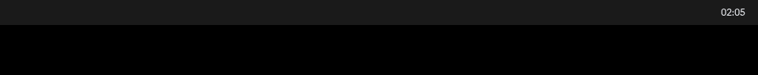
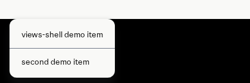

# views_shell wears a theme: the style kit and the bar on headless scroll (Chromium 154.0.8037.92)

Measured on the bench on 2026-10-02 by chapter-2 item w2b (claims C15.1 to
C15.5). Every run is `tools/bench/worker/headless.sh` under `runtime-test`
(headless stock scroll, `WLR_RENDERER=pixman`, one 1920x1080 output) with
`--ozone-platform=wayland --use-gl=angle --use-angle=swiftshader` (finding F2),
in software compositing (the default since w1a). The whole sequence is
`tools/bench/seq/w2b.sh`, run as unit `vs-w2b-seq` under `~/views-bench/bench.lock`:
wire, `ensure-out.sh views`, `gn check '//views_shell/*'`, build, the unit tests,
six headless runs, the checks, and the PR's prove commands in the same lock hold
(the bench's `out/views` is relinked by whoever holds the lock next).

The right half of the top 96 rows of the `--bar --theme examples/themes/claude-dark`
screenshot: the bar's ground is the theme's `background` `#1a1a1a` exactly
(`kColorSysBase`, pinned), the clock is `foreground` `#eaecf0`
(`kColorSysOnSurface`), and below it is the compositor's empty black output.

`--bar --demo-popup --theme examples/themes/claude-light`: a light theme, and the
`xdg_popup` menu drawn by stock `views::MenuItemView` from the same pinned roles.

## What runs

- `shell/style/`: `theme_directory` (the `colors.toml` subset parser, documented
  in `style/tokens/README.md`), `omarchy_cascade` (Omarchy's resolver ported, MIT),
  `theme_mixer` (the layer-1 seed on the native theme, one pin mixer appended last,
  live re-apply), the GN action `theme_map_table` (`gen_theme_map.py`:
  `//views_shell/data/style/theme-map.json` to a table of 29 `ui::kColorSys*`
  enumerators; the seq log prints `generated table: 29 pins`), and the kit's
  `ShellLayoutProvider` / `ShellTypographyProvider`.
- `shell/bar/`: `BarView` (a `FlexLayout` row; the left section empty and
  flexible, the `ClockView` on the right; ground `kColorSysBase`, ink
  `kColorSysOnSurface`, no literals) and `ClockView` (`HH:MM`, one
  `base::OneShotTimer` armed for the next wall-clock minute and re-armed on each
  tick).
- `shell/app/surface_spec.{h,cc}`: the registry `bar`, `left-tabs` and
  `notification`; `ShellViewsDelegate::OnBeforeWidgetInit` CHECKs every widget
  against it (rule R1). `views_shell` without `--bar` or `--left-tabs` prints
  `views-shell draws only on layer surfaces (rule R1); pass --bar (or --left-tabs)`
  and exits 2 before connecting to anything. Chapter 1's C3.4 window run (an
  `xdg_toplevel` with a label) is superseded: there is no window mode, and
  `--left-tabs` is now a layer surface on the left edge.

## Unit tests (C15.1)

`views_shell_unittests --gtest_filter='Theme*:Bar*:Clock*'`: 27 tests, all OK,
`SUCCESS: all tests passed.`

| Suite | Tests |
|---|---|
| `ThemeFixtureTest` | `AllBlack`, `ClaudeDark`, `ClaudeLight`, `Noir` (each: the cascade reproduces `<theme>.resolved.json` and the mixer `<theme>.mixer.json`, as canonical JSON), `EveryFixtureInTheDirectory` (enumerates `style/tokens/fixtures/`, requires one pair per example theme) |
| `ThemeCascadeTest` | `MixesLikeOmarchy`, `AnsiOnlyTheme`, `ModeFromLuminanceAndMarker` (expected values are the vendored script's own output) |
| `ThemeDirectoryTest` | the subset accepted, everything outside it rejected with its line number, hex colours, an example directory, `light.mode` and `chromium.theme`, a missing `colors.toml` |
| `ThemeMixerTest` | seed neutralisation, WCAG contrast, seed and mode of the examples, a `ui::ColorProvider` for `all-black` and for `claude-dark` (pinned ids exact, `kColorLabelForeground` follows `kColorSysOnSurface`, the unpinned stock base differs), `LiveReapply` (all-black, then claude-light: observers notified twice, a fresh provider has the new pins) |
| `ThemeKitProvidersTest` | stock defaults, spacing scale and font delta |
| `BarViewTest`, `ClockViewTest`, `ClockFormatTest` | the clock at the right edge with the kit's padding, the theme ids, `HH:MM`, the delay to the next minute, and on mock time exactly one pending wake-up that fires on each minute |

## Runs

All six: client alive at capture, one `zwlr_layer_shell_v1.get_layer_surface`,
no `get_toplevel` in any run, 15 threads, 0 to 0.1 % CPU over 10 s.

| Run | Flags | Attaches | Colours (sampled) | Top 32 rows = theme background | PSS MB | FDs |
|---|---|---|---|---|---|---|
| `w2b-claude-dark` | `--bar --theme …/claude-dark` | 1 | 3 | `#1a1a1a`, 99.8 % | 108.8 | 353 |
| `w2b-all-black` | `--bar --theme …/all-black` | 1 | 2 | `#000000`, 99.8 % | 107.9 | 352 |
| `w2b-noir` | `--bar --theme …/noir` | 1 | 1 to 2 | `#000000`, 99.8 % | 108.4 | 353 |
| `w2b-plain` | `--bar` (stock `ui/color`, light) | 1 | 3 | n/a | 108.2 | 352 |
| `w2b-light-popup` | `--bar --demo-popup --theme …/claude-light` | 12, one `get_popup` | 50 | `#f9f9f7`, 98.1 % (the menu covers part) | 109.4 | 354 |
| `w2b-left-tabs` | `--left-tabs --theme …/noir` | 1 | 9 | n/a (`left-tabs: 4 workspaces from static, active 1  Web`) | 111.8 | 352 |

The remaining 0.2 % of the bar is the clock's glyphs. On a black theme the
sampled colour count can be 1: the bar and the empty output are both black and the
7-pixel sampling stride may miss the clock. The theme is logged at start, e.g.
`theme: …/examples/themes/claude-dark mode dark seed #1a1a1a, 29 kColorSys pins`.
`--theme /nonexistent` exits 2 with `--theme: /nonexistent/colors.toml: cannot be read`.

PSS is the same as w1a's software-compositing bar (107 MB): the kit, the mixer and
the clock add nothing measurable. Same caveat as the other records: pixman and
software compositing make the numbers indicative only.

## Findings

- `base::CommandLine` takes switch values only as `--theme=<dir>`; with
  `--theme <dir>` the directory is a positional argument and the switch is empty.
  `views_shell` accepts both (an empty `--theme` takes the first positional
  argument).
- `views::Label` needs an `AXPlatform` instance; a unit test that builds one
  without the bootstrap holds a `ui::AXPlatformForTest`
  (`//ui/accessibility:test_support`). `EXPECT_EQ` on `gfx::Insets` needs
  `gfx::PrintTo`, which lives in `//ui/gfx:test_support`; the test compares text.
- At 154 the dictionary type is `base::DictValue` (no `base::Value::Dict`), and
  `-Wunsafe-buffer-usage` rejects indexing a C array in `views_shell/`.
- Omarchy's `mix_color` relies on GNU awk's `index()` of an empty needle being 1:
  an absent hue derives `bright_* = #333333` and an absent `orange` derives
  `brown = #000000`. The C++ port reproduces that.
- A first-word check (`split('background')[1]`) finds the wrong line in
  `all-black/colors.toml`, whose header comment says "background" first; the
  checks match `^background = "#…"`.
